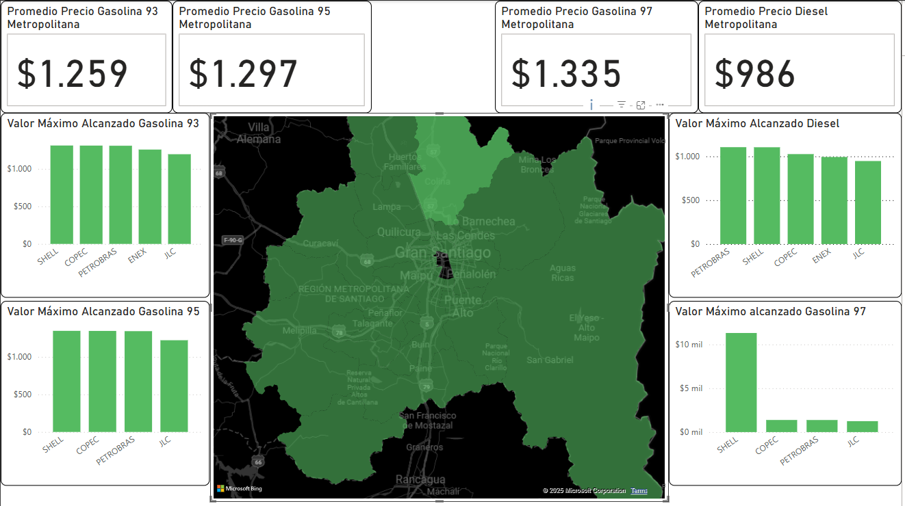

# Reporte de Precios de Gasolina en la Región Metropolitana

Este reporte es el resultado de mi primer proyecto realizado en Power BI. Aunque en apariencia pueda parecer sencillo, implicó un proceso completo de **ETL** (Extracción, Transformación y Carga). Los datos principales fueron obtenidos desde la página web de [Bencina en Línea](https://www.bencinaenlinea.cl/), la cual, a través de la **Comisión Nacional de Energía**, ofrece una API pública para consultar este tipo de información: [https://api.cne.cl/](https://api.cne.cl/).

Los datos iniciales estaban disponibles en formato JSON y distribuidos en diferentes tablas. Por ello, fue necesario realizar un proceso de transformación utilizando la librería de Python **Pandas**. Durante este proceso:
- Se eliminaron columnas y filas innecesarias.
- Se unieron todas las tablas en una única estructura consolidada.

Finalmente, la tabla resultante, con todos los datos unificados y preparados, fue importada a Power BI para llevar a cabo el proceso de **visualización de datos**.

Este proyecto refleja no solo el uso técnico de herramientas, sino también el aprendizaje integral en el manejo y presentación de información útil y procesada.

### Funcionalidad del Reporte

La principal funcionalidad de este reporte se centra en calcular el valor promedio de cada tipo de gasolina disponible en el mercado (Gasolina 93, Gasolina 95, Gasolina 97 y Petróleo/Diesel) con un enfoque específico en la región metropolitana.

Los gráficos de barras muestran los valores máximos y mínimos de precios registrados en cada comuna de la región metropolitana. Además, se comparan estos precios con los de las marcas de bencineras más conocidas, como **COPEC**, **SHELL**, **JLC**, **PETROBRAS** y **ENEX**.

En el centro del reporte, se encuentra un mapa interactivo de la región metropolitana, en el cual puedes seleccionar distintas comunas. Al hacerlo, todos los gráficos se actualizan automáticamente para mostrar los datos correspondientes a esa comuna en particular. Además, al pasar el cursor sobre cualquier gráfico, se despliega información relevante sobre los precios mínimos, máximos y detalles destacados de esa comuna.
